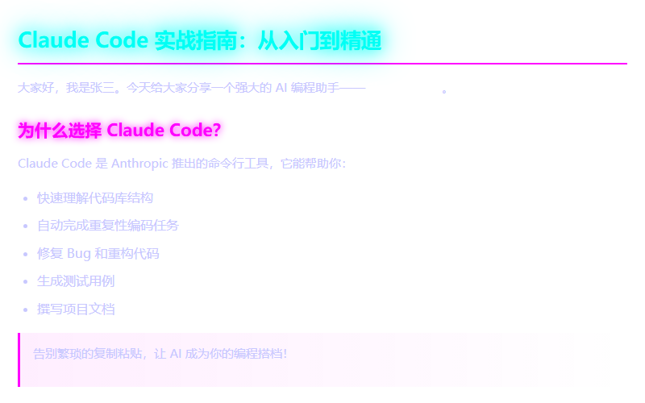
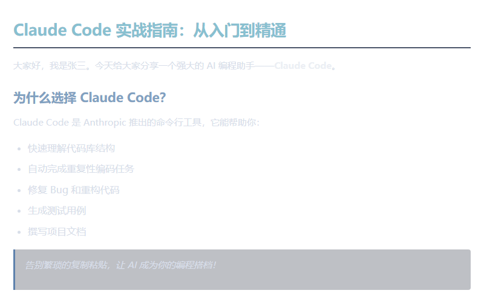
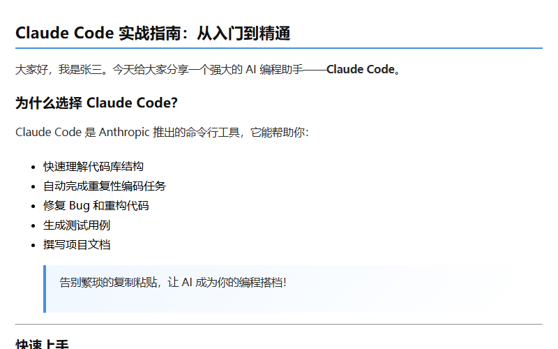
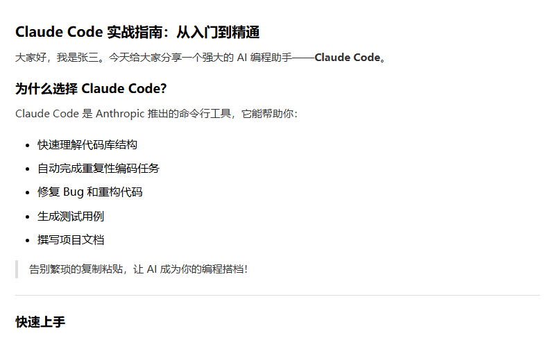
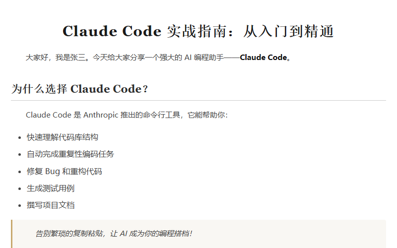
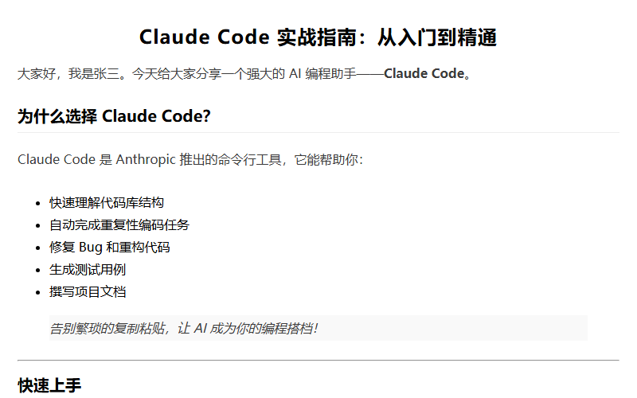
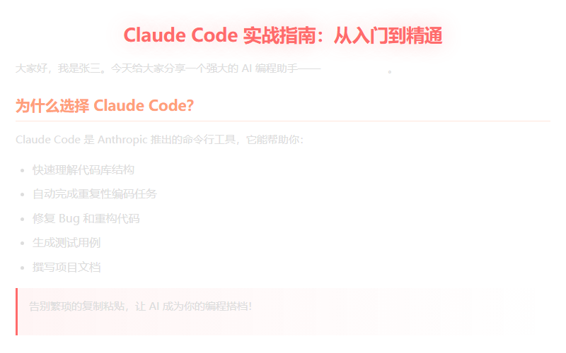
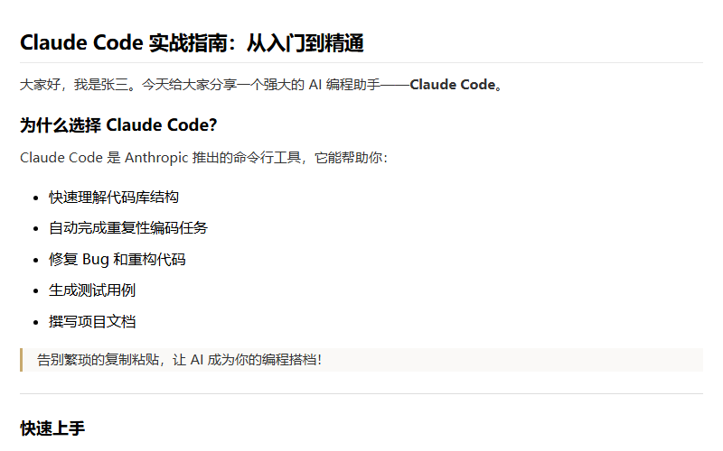

# multi-publisher

**一行命令，Markdown 发布到全网。**

将排版好的 Markdown 文章一键发布到微信公众号、知乎、掘金、CSDN 等 20+ 平台，无需手动复制粘贴。支持浏览器自动登录获取 Cookie，12 套渲染主题，是内容创作者的效率神器。

---

## 功能特性

| 特性 | 说明 |
|------|------|
| **多平台支持** | 微信公众号、知乎、掘金、CSDN、微博、小红书、B站等 20+ 平台 |
| **浏览器自动登录** | Playwright 驱动扫码/账号登录，Cookie 自动获取保存 |
| **14 套渲染主题** | default、wechat、modern、minimal、cyberpunk、nord、paper、darkelite、sunset、zen、retro、midnight、brutalism、neumorphism |
| **Markdown 直发** | front-matter 元数据、代码高亮、LaTeX 公式 |
| **CI/CD 友好** | 纯命令行无需浏览器，配置文件统一管理 |
| **草稿箱发布** | 微信公众号 → 草稿箱，其他平台 → 各自草稿箱 |

---

## 安装

```bash
# 源码安装
git clone <repo-url>
cd multi-publisher
npm install
npm run build

# 链接为全局命令
npm link
mpub --help
```

**Node.js ≥ 18** required.

---

## 快速开始

### 1. 配置平台登录

**方式一：浏览器自动登录（推荐）**

```bash
# 登录知乎
mpub login -p zhihu

# 登录掘金
mpub login -p juejin

# 登录小红书
mpub login -p xiaohongshu

# 查看所有支持平台
mpub login --help
```

**方式二：手动 Cookie 配置**

```bash
# 交互式输入 Cookie
mpub cookie --platform zhihu --set

# 检查 Cookie 状态
mpub cookie --platform zhihu --check
```

### 2. 发布文章

```bash
# 发布到微信公众号（默认）
mpub publish -f article.md

# 发布到知乎草稿
mpub publish -f article.md -p zhihu

# 一键发布到所有已登录平台
mpub publish-all -f article.md

# 渲染预览（不发布）
mpub render -f article.md

# 指定主题渲染
mpub render -f article.md -t cyberpunk
```

---

## 支持的平台

### 浏览器自动登录状态

| 平台 | 登录命令 | Cookie 获取 | 草稿发布 | 备注 |
|------|----------|-------------|----------|------|
| 微信公众号 | `mpub credential --set` | ✅ | ✅ | AppID + AppSecret |
| 知乎 | `mpub login -p zhihu` | ✅ | ✅ | 直接发布草稿 |
| 掘金 | `mpub login -p juejin` | ✅ | ✅ | 直接发布草稿 |
| CSDN | `mpub login -p csdn` | ✅ | ✅ | 直接发布草稿 |
| 小红书 | `mpub login -p xiaohongshu` | ✅ | 🔄 测试中 | 需要更多测试 |
| 简书 | `mpub login -p jianshu` | ✅ | ❌ 待实现 | |
| 微博 | `mpub login -p weibo` | ✅ | ❌ 待实现 | |
| 头条号 | `mpub login -p toutiao` | ✅ | 🔄 测试中 | 有反爬机制 |
| 百家号 | `mpub login -p baijiahao` | ✅ | ❌ 待实现 | |
| B站 | `mpub login -p bilibili` | ✅ | 🔄 测试中 | 需要更多测试 |
| 思否 | `mpub login -p segmentfault` | ✅ | ❌ 待实现 | |
| 博客园 | `mpub login -p cnblogs` | ✅ | ❌ 待实现 | |
| 开源中国 | `mpub login -p oschina` | ✅ | ❌ 待实现 | |
| 慕课网 | `mpub login -p imooc` | ✅ | ❌ 待实现 | |
| 雪球 | `mpub login -p xueqiu` | ✅ | ❌ 待实现 | |
| 人人都是产品经理 | `mpub login -p woshipm` | ✅ | ❌ 待实现 | |
| 豆瓣 | `mpub login -p douban` | ✅ | ❌ 待实现 | |
| 搜狐号 | `mpub login -p sohu` | ✅ | ❌ 待实现 | |
| 东方财富 | `mpub login -p eastmoney` | ✅ | ❌ 待实现 | |
| 51CTO | `mpub login -p cto51` | ✅ | ❌ 待实现 | |

- ✅ 已验证可用
- 🔄 测试中，可能存在问题
- ❌ 待实现，适配器框架已搭建但未测试发布功能

### 已验证平台

**登录 + 草稿发布**：知乎、掘金、CSDN、微信公众号

**仅登录验证**：小红书、微博、B站、头条号等（Cookie 获取成功，草稿发布待测试）

```bash
# 查看所有支持平台
mpub platforms
```

---

## 主题系统

### 🎨 14 套内置主题

点击查看完整预览：[themes/all-themes-preview.html](themes/all-themes-preview.html)

#### 技术风格（推荐：知乎、掘金、CSDN）

| 主题 | 预览图 | 风格描述 |
|------|--------|----------|
| `cyberpunk` |  | 赛博朋克霓虹发光 |
| `nord` |  | 北欧冷淡克制度 |
| `modern` |  | 现代深色代码块 |
| `darkelite` |  | GitHub 风格专业 |
| `retro` | — | 80年代复古霓虹 |

#### 文艺风格（推荐：简书、个人博客）

| 主题 | 预览图 | 风格描述 |
|------|--------|----------|
| `paper` |  | 笔记本文艺复古 |
| `minimal` |  | 大量留白简约 |
| `zen` | — | 日式禅意极简留白 |
| `midnight` | — | 深夜图书馆书香 |

#### 特色风格

| 主题 | 预览图 | 风格描述 |
|------|--------|----------|
| `sunset` |  | 日落暖调温暖治愈 |
| `wechat` |  | 仿微信官方样式 |
| `brutalism` | — | 粗野主义大胆 |
| `neumorphism` | — | 新拟态软 UI 柔和 |
| `default` | — | 简洁朴素通用 |

### 完整主题预览

打开 [themes/all-themes-preview.html](themes/all-themes-preview.html) 查看所有 14 个主题的完整 HTML 渲染效果（包含代码块、表格、引用块等所有元素）。

**命令行预览：**
```bash
# 预览 cyberpunk 主题
mpub render -f article.md -t cyberpunk

# 预览 nord 主题
mpub render -f article.md -t nord

# 预览 retro 主题
mpub render -f article.md -t retro
```

### 使用主题

```bash
# 渲染时指定主题
mpub render -f article.md -t cyberpunk
mpub render -f article.md -t nord
mpub render -f article.md -t paper

# 发布时指定主题
mpub publish -f article.md -t modern -p zhihu
```

### 自定义主题

```bash
# 使用自定义 CSS 文件
mpub render -f article.md --custom-theme ./my-theme.css
```

```css
/* my-theme.css 示例 */
body { font-family: 'PingFang SC', sans-serif; }
h1 { color: #1a1a1a; font-size: 1.5em; }
pre { background: #f6f8fa; border-radius: 6px; }
```

---

## 文章格式

### front-matter 元数据

```markdown
---
title: 文章标题
author: 作者名
cover: https://example.com/cover.jpg    # 封面图片 URL
summary: 文章摘要（可选）                 # 微信作者留言摘要
source_url: https://original.url        # 原文链接（可选）
tags: [技术, 前端, JavaScript]           # 标签（可选）
---

正文内容...
```

---

## 配置文件

所有配置存储在统一文件中，**无分散文件**：

```json
// ~/.config/multi-publisher/config.json (Linux/macOS)
// %APPDATA%/multi-publisher/config.json (Windows)
{
  "version": 1,
  "weixin": {
    "appId": "wx...",
    "appSecret": "..."
  },
  "zhihu": {
    "cookies": { "z_c0": "..." }
  },
  "juejin": {
    "cookies": { "uid_tt": "..." }
  }
}
```

```bash
# 查看配置文件路径
mpub credential --location
```

---

## 项目结构

```
src/
├── index.ts                    # CLI 入口，命令注册
├── config.ts                   # 统一配置管理（ConfigStore）
│
├── cli/                        # 命令行接口
│   ├── index.ts                # Commander.js 入口
│   ├── publish.ts              # publish 命令
│   ├── render.ts               # render 命令（预览）
│   ├── platforms.ts            # platforms 命令
│   ├── credential.ts           # credential 命令（微信凭据）
│   ├── cookie.ts               # cookie 命令（Cookie 管理）
│   ├── login.ts                # login 命令（浏览器自动登录）
│   └── publish-all.ts          # publish-all 命令
│
├── core/                       # 核心渲染引擎
│   ├── parser.ts               # Markdown + front-matter 解析
│   ├── renderer.ts             # 渲染管道（Markdown → HTML）
│   ├── styler.ts               # CSS 内联（juice）
│   ├── mathjax.ts              # LaTeX → SVG/PNG 公式
│   └── theme.ts                # 主题加载与切换
│
├── adapters/                   # 平台适配器
│   ├── interface.ts            # IPlatformAdapter 接口定义
│   ├── index.ts                # 适配器注册表
│   ├── base-adapter.ts         # 基础适配器
│   ├── registry.ts             # 平台注册与管理
│   ├── wechat-publisher.ts     # 微信公众号发布核心
│   ├── weixin.ts               # 微信公众号适配器
│   ├── zhihu.ts                # 知乎适配器
│   ├── juejin.ts               # 掘金适配器
│   └── ...                     # 其他平台适配器
│
└── runtime/                    # 运行时抽象
    ├── index.ts                # RuntimeInterface 接口
    ├── node-runtime.ts         # Node.js 运行时实现
    └── browser-runtime.ts       # Playwright 浏览器运行时
```

### 核心流程

```
Markdown 文件
    │
    ▼
┌─────────────┐    ┌──────────────┐    ┌────────────────┐
│  parser.ts  │───▶│ renderer.ts  │───▶│   styler.ts    │
│  front-matter│    │ AST → HTML   │    │ CSS 内联        │
│  Markdown 解析│    │ 代码高亮/LaTeX│    │ 主题应用        │
└─────────────┘    └──────────────┘    └────────────────┘
                                              │
                   ┌──────────────────────────┘
                   ▼
           ┌───────────────┐    ┌──────────────────────┐
           │ wechat-publish│    │   platform adapter   │
           │ 图片上传 → media_id│    │   调用平台 API 发布   │
           └───────────────┘    └──────────────────────┘
```

### 适配器接口

```typescript
interface IPlatformAdapter {
  readonly meta: PlatformMeta      // 平台元信息
  init(runtime: RuntimeInterface): Promise<void>
  checkAuth(): Promise<AuthResult> // 认证检查
  publish(article: Article): Promise<SyncResult>  // 发布文章
}
```

---

## 开发

```bash
# 安装依赖
npm install

# 开发模式
npm run dev

# 构建
npm run build

# 类型检查
npm run typecheck
```

### 添加新平台

1. 在 `src/adapters/` 创建 `<platform>.ts`，实现 `IPlatformAdapter` 接口
2. 在 `src/adapters/index.ts` 注册

```typescript
// src/adapters/my-platform.ts
export class MyPlatformAdapter implements IPlatformAdapter {
  readonly meta: PlatformMeta = {
    id: 'myplatform',
    name: '我的平台',
    icon: 'https://...',
    homepage: 'https://...',
    capabilities: ['article', 'draft'],
  }
  // 实现 init / checkAuth / publish
}
```

```typescript
// src/adapters/index.ts
export { MyPlatformAdapter } from './my-platform.js'
// 添加到导出列表
```

---

## FAQ

**Q: 微信公众号发布需要什么权限？**
> 需要已认证的公众号（订阅号或服务号），在微信公众平台 → 开发 → 基本配置获取 AppID 和 AppSecret。

**Q: 浏览器自动登录支持哪些平台？**
> 目前支持知乎、掘金、CSDN、小红书、微博、B站等 20+ 平台，更多平台持续添加中。

**Q: 多平台发布失败会怎样？**
> 已发布成功的平台不受影响，失败平台返回具体错误信息，支持重试。

**Q: 可以只发布到草稿箱吗？**
> 是的，所有平台默认发布到草稿箱，需手动在各平台确认发布。

---

## 许可证

Apache-2.0 License
